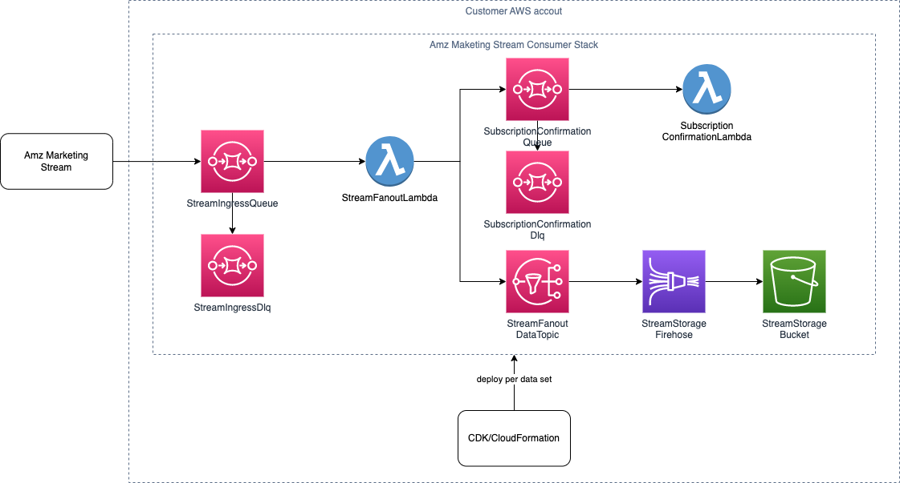

# Amazon Marketing Stream reference implementation using AWS CDK

This project contains an example implementation and infrastructure code to:

1. Provisions necessary AWS infrastructure to receive and store Amazon Marketing Stream data, as well as confirm Stream dataset subscriptions.
2. Subscribe to datasets and manage subscriptions using a CLI.

## Disclaimer
This is a reference implementation, and not the only definitive way to consume Amazon Marketing Stream data. Note that this implementation is subject to change and future releases may not be backwards compatible.

## Solution architecture


This application is developed using Python and AWS Cloud Development Kit (CDK).

The application provisions the following AWS infrastructure components for each dataset and region combination:

- An [SQS queue](https://docs.aws.amazon.com/sqs/index.html) (StreamIngressQueue) that receives initial messages from Stream.
- A [lambda](https://docs.aws.amazon.com/lambda/index.html) (StreamFanoutLambda) that identifies whether a message contains subscription details or data.
- A second SQS queue (SubscriptionConfirmationQueue) that forwards subscription confirmation messages to a second lambda (SubscriptionConfirmationLambda) that confirms the subscription.
- An [SNS topic](https://docs.aws.amazon.com/sns/index.html) (StreamFanoutDataTopic that) forwards data through a [KinesisDateFirehouse](https://docs.aws.amazon.com/firehose/latest/dev/what-is-this-service.html) (StreamStorageFirehose) to an [S3 bucket](https://docs.aws.amazon.com/s3/index.html) (StreamStorageBucket) where the data is stored.

Note: The provisioning of each SQS queue also includes an associated [dead-letter queue](https://docs.aws.amazon.com/AWSSimpleQueueService/latest/SQSDeveloperGuide/sqs-dead-letter-queues.html).

## Video tutorial

Learn how to set up the reference application by watching our [video demo](https://www.youtube.com/embed/_4o6QuTZxxs).
  
## Supported datasets

This package includes following templates for all available datasets for advertising regions NA, EU, and FE. All NA stacks will be deployed in AWS region `us-east-1`, EU stacks will be deployed in AWS region `eu-west-1`, and FE stacks will be deployed in AWS region `us-west-2` to minimize latency of message delivery. For more information on datasets, see the [Stream data guide](https://advertising.amazon.com/API/docs/en-us/amazon-marketing-stream/data-guide).

* AmzStream-NA-sp-traffic
* AmzStream-NA-sp-conversion
* AmzStream-NA-budget-usage
* AmzStream-NA-sd-traffic
* AmzStream-NA-sd-conversion
* AmzStream-NA-sb-traffic
* AmzStream-NA-sb-conversion
* AmzStream-NA-sb-clickstream
* AmzStream-NA-sb-rich-media
* AmzStream-NA-campaigns
* AmzStream-NA-adgroups
* AmzStream-NA-ads
* AmzStream-NA-targets
* AmzStream-NA-sponsored-ads-campaign-diagnostics-recommendations
* AmzStream-NA-sp-budget-recommendations
* AmzStream-EU-sp-traffic
* AmzStream-EU-sp-conversion
* AmzStream-EU-budget-usage
* AmzStream-EU-sd-traffic
* AmzStream-EU-sd-conversion
* AmzStream-EU-sb-traffic
* AmzStream-EU-sb-conversion
* AmzStream-EU-sb-clickstream
* AmzStream-EU-sb-rich-media
* AmzStream-EU-campaigns
* AmzStream-EU-adgroups
* AmzStream-EU-ads
* AmzStream-EU-targets
* AmzStream-EU-sponsored-ads-campaign-diagnostics-recommendations
* AmzStream-EU-sp-budget-recommendations
* AmzStream-FE-sp-traffic
* AmzStream-FE-sp-conversion
* AmzStream-FE-budget-usage
* AmzStream-FE-sd-traffic
* AmzStream-FE-sd-conversion
* AmzStream-FE-sb-traffic
* AmzStream-FE-sb-conversion
* AmzStream-FE-sb-clickstream
* AmzStream-FE-sb-rich-media
* AmzStream-FE-campaigns
* AmzStream-FE-adgroups
* AmzStream-FE-ads
* AmzStream-FE-targets
* AmzStream-FE-sponsored-ads-campaign-diagnostics-recommendations
* AmzStream-FE-sp-budget-recommendations
  
## Development prerequisites

- [AWS account](https://docs.aws.amazon.com/accounts/latest/reference/manage-acct-creating.html)
- [AWS Cloud Development Kit (CDK)](https://docs.aws.amazon.com/cdk/v2/guide/getting_started.html)
- Python 3.7 or later including pip and virtualenv
  
We recommend exploring the contents of this project and familiarizing yourself with the AWS infrastructure before deploying.  
  
## Deployment steps

1. Initialize your project and activate a virtualenv. The `cdk.json` file tells the CDK Toolkit how to execute your app. This project is set up like a standard Python project. The initialization process creates a virtualenv within this project, stored under the .venv directory.  To create the virtualenv, it assumes that there is a `python3` executable in your path with access to the `venv` package. If the automatic creation of the virtualenv fails, you can always create the virtualenv manually once the init process completes.
   
    **Manually create a virtualenv on MacOS and Linux**
   
    ```
    $ python3 -m venv .venv
    ```

    After the init process completes and the virtualenv is created, you can use the following step to activate your virtualenv.

    ```
    $ source .venv/bin/activate
    ```

    **Manually create a virtualenv on Windows**

    ```
    % .venv\Scripts\activate.bat
    ```

2. Install the required dependencies.
   
    ```
    $ pip install -r requirements.txt
    ```

3. Synthesize the CloudFormation templates for this code.
   
    ```
    $ cdk synth
    ```

    To view the CloudFormation templates created by the synthesize step.

    ```
    $ cdk ls
    ```

4. Deploy CloudFormation templates.
   
   Depending on your requirements, you can choose to deploy all CloudFormation templates or individual templates.
   
    ```
    $ cdk deploy --all
    ```

    or

    ```
    $ cdk deploy AmzStream-NA-sp-traffic
    ```

    At the end of deployment, your output should resemble:  

    ```
    Outputs:
    AmzStream-NA-sp-traffic.IngressIngressQueue91B67342 = arn:aws:sqs:us-east-1:2xxxxxxxxxxx:AmzStream-NA-sp-traffic-IngressQueue26236266-Jvxxxxxxxxxx
    AmzStream-NA-sp-traffic.StorageLandingZoneBucketFE2101CB = arn:aws:s3:::amzstream-na-sp-traffic-storagelz10f6c360-1hxxxxxxxxxxx
    Stack ARN:
    arn:aws:cloudformation:us-east-1:2xxxxxxxxxxx:stack/AmzStream-NA-sp-traffic/57151cc0-b625-11ed-a641-12730e200e31
    ```

    Note:
    *  This example uses `AmzStream-NA-sp-traffic` as an example.
    * `AmzStream-NA-sp-traffic.IngressIngressQueue91B67342` is the name of the example queue that will receive messages for dataset `sp-traffic` from NA region.
    * `arn:aws:sqs:us-east-1:2xxxxxxxxxxx:AmzStream-NA-sp-traffic-IngressQueue26236266-Jvxxxxxxxxxx` is the ARN of the example queue and should be used for field `destinationArn` while calling the subscription API as listed in the [subscription step](https://advertising.amazon.com/API/docs/en-us/amazon-marketing-stream/onboarding#step-3-subscribe-to-amazon-marketing-stream-datasets) of the onboarding guide.
    * `AmzStream-NA-sp-traffic.StorageLandingZoneBucketFE2101CB` is the name of the example S3 bucket that will store all the received messages for this dataset.

## Useful CDK commands

* `cdk ls`          Lists all stacks in the app
* `cdk synth`       Emits the synthesized CloudFormation template
* `cdk bootstrap`   Deploys the CDK toolkit stack into an AWS environment
* `cdk deploy`      Deploys this stack to your default AWS account/region
* `cdk diff`        Compares deployed stack with current state
* `cdk docs`        Opens CDK documentation
* `cdk destroy`     Destroys this stack to your default AWS account/region
  
## Using the Stream subscription management command line tool <a name="stream-subscription-cli-tool"></a>

We provide a Stream subscription management command line tool that supports following commands:

* Create - Creates an Amazon Marketing Stream subscription.
* Get - Gets information on a Amazon Marketing Stream subscription by ID.
* List - Lists all Amazon Marketing Stream subscriptions associated with your Amazon Advertising API profile.
* Update - Updates an Amazon Marketing Stream subscription by ID.

In order to use the CLI, you must create a credentials.yml file with your Amazon Ads API credentials. If you don't have credentials for the Ads API, review the [Onboarding process](https://advertising.amazon.com/API/docs/en-us/onboarding/overview).
  
### Search path for credentials.yml

* macOS and Other Unix: `~/.config/python-ad-api`
* Windows: `%APPDATA%\python-ad-api` where the <cite>APPDATA</cite> environment variable falls back to `%HOME%\AppData\Roaming` if undefined

For more information, see [Python Confuse module help](https://confuse.readthedocs.io/en/latest/usage.html#search-paths).
  
Example: `~/.config/python-ad-api/credentials.yml`
  
```javascript
version: '1.0'

default:
  refresh_token: 'your-refresh-token'
  client_id: 'your-client-id'
  client_secret: 'your-client-secret'
  profile_id: 'your-profile-id'
``` 

### Querying and aggregating Stream data
Once you start receiving Stream data in AWS, you can learn more about aggregating and querying Stream data in our documentation.

- [Querying Stream data](https://advertising.amazon.com/API/docs/en-us/amazon-marketing-stream/querying-data)
- [Aggregating and joining traffic and conversion Stream data](https://advertising.amazon.com/API/docs/en-us/amazon-marketing-stream/aggregating-data)

### Using the CLI

You can view instructions for using the CLI using `python -m amz_stream_cli --help`.

Example:

```
% python -m amz_stream_cli --help

                                                                                                                                       
 Usage: amz_stream_cli [OPTIONS] COMMAND [ARGS]...                                                                                     
                                                                                                                                       
╭─ Options ──────────────────────────────────────────────────────────────────────────────────────────────────────────╮
│ --version             -v        Show the application's version and exit.                                           │
│ --install-completion            Install completion for the current shell.                                          │
│ --show-completion               Show completion for the current shell, to copy it or customize the installation.   │
│ --help                          Show this message and exit.                                                        │
╰────────────────────────────────────────────────────────────────────────────────────────────────────────────────────╯
╭─ Commands ─────────────────────────────────────────────────────────────────────────────────────────────────────────╮
│ create    Creates Amazon Marketing Stream subscription.                                                            │
│ get       Gets information on specific Amazon Marketing Stream subscription by ID.                                 │
│ list      Lists all Amazon Marketing Stream subscriptions associated with your Amazon Advertising API account.     │
│ update    Updates specific Amazon Marketing Stream subscription by ID.                                             │
╰────────────────────────────────────────────────────────────────────────────────────────────────────────────────────╯
```

For help on individual commands, use the following:

* `python -m amz_stream_cli create --help`
* `python -m amz_stream_cli get --help`
* `python -m amz_stream_cli list --help`
* `python -m amz_stream_cli update --help`
